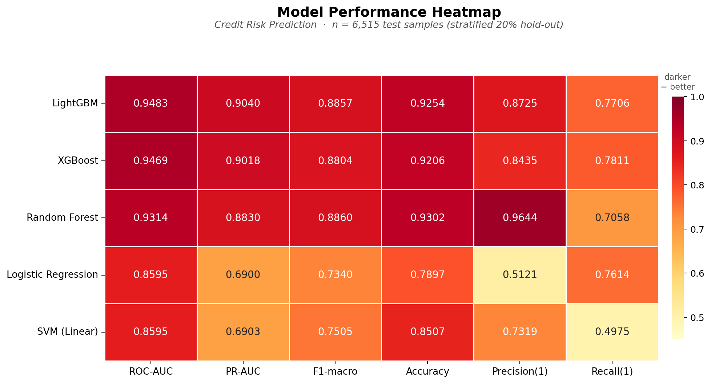

# Credit Risk Prediction

<p align="center">
  
</p>


Binary classification of loan default risk using five machine learning models.  
**Best result — LightGBM: ROC-AUC 0.9483 · PR-AUC 0.9040 · F1-macro 0.8857**

---

## Results

| Model | ROC-AUC | PR-AUC | F1-macro | Precision (default) | Recall (default) |
|---|---|---|---|---|---|
| **LightGBM** | **0.9483** | **0.9040** | 0.8857 | 0.8725 | 0.7706 |
| XGBoost | 0.9469 | 0.9018 | 0.8804 | 0.8435 | **0.7811** |
| Random Forest | 0.9314 | 0.8830 | **0.8860** | **0.9644** | 0.7058 |
| Logistic Regression | 0.8595 | 0.6900 | 0.7340 | 0.5121 | 0.7614 |
| SVM (Linear) | 0.8595 | 0.6903 | 0.7505 | 0.7319 | 0.4975 |

> Evaluated on a stratified 20% hold-out test set (6,515 rows). Class imbalance (~78/22) handled via `class_weight='balanced'` / `scale_pos_weight`.

---

## Dataset

**Source:** [Kaggle — Credit Risk Dataset](https://www.kaggle.com/datasets/laotse/credit-risk-dataset)

| Property | Value |
|---|---|
| Raw rows | 32,581 |
| Features | 12 |
| Target | `loan_status` (0 = repaid, 1 = default) |
| Class split | 78.2% no default / 21.8% default |
| Missing values | `person_emp_length` (2.7%), `loan_int_rate` (9.6%) |

### Feature overview

| Feature | Type | Description |
|---|---|---|
| `person_age` | numeric | Applicant age (years) |
| `person_income` | numeric | Annual income |
| `person_home_ownership` | categorical | RENT / OWN / MORTGAGE / OTHER |
| `person_emp_length` | numeric | Employment length (years) |
| `loan_intent` | categorical | Purpose of the loan |
| `loan_grade` | ordinal | Lender-assigned grade (A–G) |
| `loan_amnt` | numeric | Loan amount requested |
| `loan_int_rate` | numeric | Interest rate (%) |
| `loan_percent_income` | numeric | Loan amount as % of income |
| `cb_person_default_on_file` | binary | Prior default on credit bureau record |
| `cb_person_cred_hist_length` | numeric | Length of credit history (years) |

---

## Project Structure

```
credit-risk-prediction/
├── data/
│   ├── raw/
│   │   └── credit_risk_dataset.csv
│   └── processed/
│       ├── X_train.csv / X_test.csv
│       ├── y_train.csv / y_test.csv
│       ├── credit_risk_cleaned.csv
│       └── model_results_full.csv
├── models/                        # .pkl files (git-ignored)
├── notebooks/
│   ├── 01_eda.ipynb
│   ├── 02_preprocessing.ipynb
│   ├── 03_modeling.ipynb
│   └── 04_evaluation.ipynb
│
├── requirements.txt
└── README.md
```

---

## Pipeline

### 01 — Exploratory Data Analysis
- Distribution of each feature; histograms and box plots split by target
- Class imbalance check
- Outlier detection: `person_age > 100`, `person_emp_length > 60`, `emp_length >= age`
- Correlation matrix; strongest predictors: `loan_int_rate`, `loan_percent_income`, `loan_grade`

### 02 — Preprocessing
- **Outlier removal:** impossible ages/employment lengths; income winsorized at 99.5th percentile
- **Imputation:** `person_emp_length` → global median; `loan_int_rate` → per-grade median
- **Feature engineering** (8 new features):

  | Feature | Description |
  |---|---|
  | `income_to_loan_ratio` | Income / loan amount |
  | `emp_length_to_age_ratio` | Career stability proxy |
  | `cred_hist_to_age_ratio` | Financial maturity proxy |
  | `age_group` | Life-stage bins (18–25, 26–35, 36–45, 46–60, 60+) |
  | `income_bracket` | Income quartile (Low / Mid-Low / Mid-High / High) |
  | `loan_grade_numeric` | Ordinal encoding A=1 … G=7 |
  | `high_interest_flag` | Rate above median (binary) |
  | `default_history_flag` | Prior default on file (binary) |

- **Encoding:** one-hot for `person_home_ownership`, `loan_intent`, `age_group`, `income_bracket`
- **Split:** stratified 80/20, `random_state=42` → 26,059 train / 6,515 test rows, **32 features**
- **Scaling:** `StandardScaler` fit on training set only (no data leakage)

### 03 — Modeling
Five classifiers trained with class-imbalance mitigation:

| Model | Imbalance strategy | Key hyperparameters |
|---|---|---|
| Logistic Regression | `class_weight='balanced'` | `C=1.0`, `solver='lbfgs'` |
| Linear SVM | `class_weight='balanced'` + Platt calibration | `C=1.0`, `CalibratedClassifierCV` |
| Random Forest | `class_weight='balanced'` | 300 trees, `min_samples_leaf=2` |
| XGBoost | `scale_pos_weight=3.59` | 300 estimators, `lr=0.05`, `max_depth=6` |
| LightGBM | `class_weight='balanced'` | 300 estimators, `lr=0.05`, `num_leaves=63` |

Each model is evaluated with 5-fold stratified cross-validation (ROC-AUC) and saved to `models/`.

### 04 — Evaluation
- ROC curves and Precision-Recall curves for all five models
- Row-normalised confusion matrix grid
- Decision-threshold sweep for LightGBM: optimal threshold identified at ~0.35 for max default-class F1
- Top-20 feature importance for LightGBM, XGBoost and Random Forest; consensus top-10 across all three
- Final recommendation with business context

---

## Key Findings

1. **LightGBM and XGBoost dominate** — both exceed ROC-AUC 0.94 and PR-AUC 0.90, far above the linear models (~0.86).
2. **`loan_grade_numeric`, `loan_int_rate`, and `loan_percent_income`** consistently rank as the top predictors across all three tree models.
3. **Default threshold (0.5) is suboptimal** — lowering the threshold to ~0.35 increases recall on the default class from 0.77 to ~0.85 at an acceptable precision cost.
4. **Random Forest is the most conservative** — highest precision (0.9644) but lowest recall (0.7058); preferable if false alarms are very costly.
5. **PR-AUC is more informative than ROC-AUC here** — the class imbalance makes the ROC curve optimistic; PR-AUC differences between models are more pronounced (0.68 → 0.90).

---

## Getting Started

### Requirements

```bash
pip install -r requirements.txt
pip install xgboost lightgbm
```

### Run the pipeline

Execute the notebooks in order:

```bash
jupyter notebook
```

| Step | Notebook | Output |
|---|---|---|
| 1 | `01_eda.ipynb` | Exploratory analysis & plots |
| 2 | `02_preprocessing.ipynb` | `data/processed/` splits + `scaler.pkl` |
| 3 | `03_modeling.ipynb` | `models/*.pkl` + `model_results.csv` |
| 4 | `04_evaluation.ipynb` | ROC/PR curves, feature importance, threshold analysis |

> The processed CSV files are already committed so you can start directly from notebook 03 if you prefer.

---

## Tech Stack


